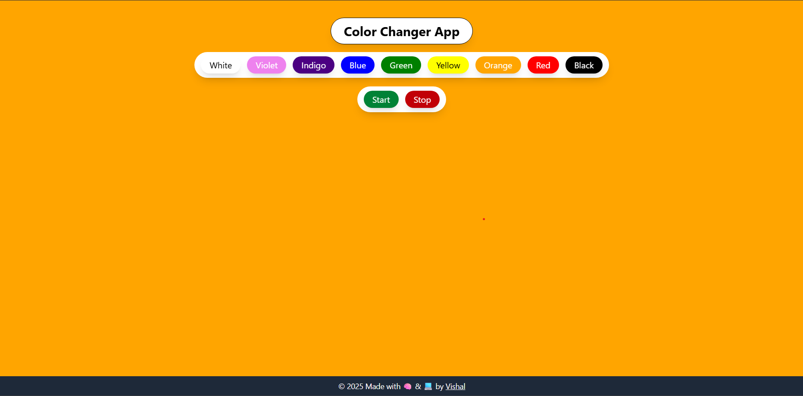

# 🎨 Background Color Visual

A visually engaging and interactive web app that lets users change the background color of the page with just a click. Built using React and Tailwind CSS.

---

## 🚀 Live Demo

[🔗 Click here to view live](https://your-deployed-link.com)

---

## 📸 Screenshot



---

## ✨ Features

- 🎨 Dynamic background color changes
- ⚡ Fast and responsive UI with Vite + React
- 🌀 Smooth transitions using Tailwind CSS
- 🧑‍🎨 Clean and minimal design
- 📱 Mobile responsive

---

## 🧑‍💻 Tech Stack

- [React](https://reactjs.org/)
- [Tailwind CSS](https://tailwindcss.com/)
- [Vite](https://vitejs.dev/)

---

## ⚙️ Getting Started

Follow these steps to run the project locally:

### Prerequisites

- Node.js and npm installed

### Installation

### Clone the repository

```bash
git clone https://github.com/Vintage-K11/react-projects.git
```

### Navigate into the project folder

```bash
cd Background-Color-Visual
```

### Install dependencies

```bash
npm install
```

### Run the development server

```bash
npm run dev
```

Open your browser at http://localhost:5173 to view the app.

## 👨‍💻 Author

Vishal
Made with ❤️ and code.
